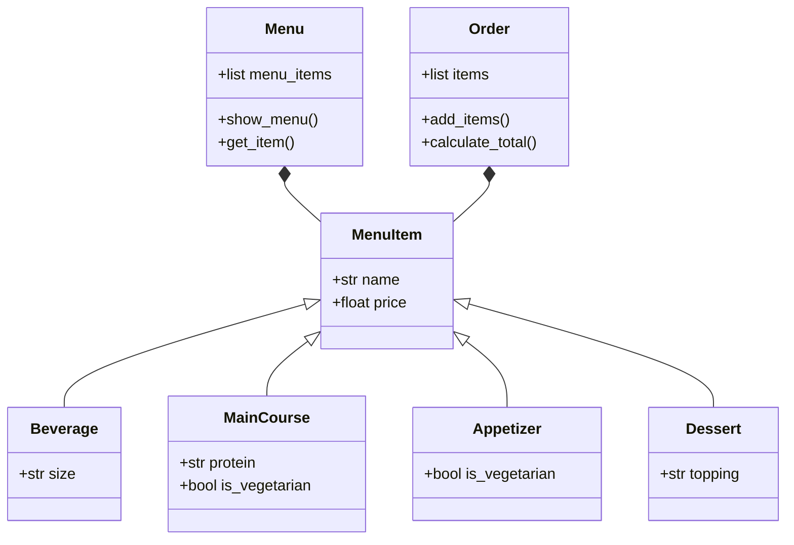

# Challenge #3 POO

### I´m Alejandro Bello Leon from "Fenomenoides" team, i attach our logo: 

<details><summary>Get ready to see the great logo: </summary><p>
<div align='center'>
<figure> </br>
<figcaption><b> "we are programmers, not designers" </b></figcaption></figure>
</div>
</p></details><br>

Below is the solution proposed to the challenge:

#### 1. Excercise proposed in class

```python
import math
class Point:
  def __init__(self, x: float, y: float):
    self.x = x
    self.y = y

class Line:
  def __init__(self, start: Point, end: Point):
    self.start = start
    self.end = end

  def compute_length(self):
    dx = self.start.x - self.end.x
    dy = self.start.y - self.end.y
    return ((dx**2 + dy**2)**0.5)
  
  def compute_slope(self):
    dx = abs(self.start.x - self.end.x)
    dy = abs(self.start.y - self.end.y)
    return(f"The slope of the line with the x axis is {math.degrees(math.atan2(dy, dx))}°")

  def compute_horizontal_cross(self):
    point1 = self.start.y
    point2 = self.end.y
    return(f"Cross with x axis: {point1 * point2 < 0}")  
    
  def compute_vertical_cross(self):
    point1 = self.start.x
    point2 = self.end.x
    return(f"cross with y axis: {point1 * point2 < 0}")
  
  def dicretize_line(self, size):
    points = []
    scalex = 0
    scaley = 0
    dx = (self.end.x - self.start.x) / (size)
    dy = (self.end.y - self.start.y) / (size)
    for i in range(size):
      scalex += dx
      scaley += dy
      points.append((self.end.x - scalex, self.end.y - scaley))

    return points

class Rectangle:
  def __init__(self, width1: Line, height1: Line, width2: Line, height2: Line):
    self.width1 = width1
    self.height1 = height1
    self.width2 = width2
    self.height2 = height2
    
  def compute_area(self):
    return(f"Area: {self.height1.compute_length() * self.width1.compute_length()}")

  def compute_perimeter(self):
    return(f"Perimeter: {self.width1.compute_length() + self.height1.compute_length() + self.width2.compute_length() + self.height2.compute_length()}")
```
And the usage example:

```python
if __name__ == "__main__":

  # First Line
  start1 = Point(0,0)
  end1 = Point(0,5)

  line1 = Line(start1, end1)
  print(line1.compute_length())
  print(line1.compute_slope())
  print(line1.compute_horizontal_cross())
  print(line1.compute_vertical_cross())

  print("-----------------------------------")

  # Second line
  start2 = Point(0,0)
  end2 = Point(4,0)

  line2 = Line(start2, end2)
  print(line2.compute_length())
  print(line2.compute_slope())  
  print(line2.compute_horizontal_cross())
  print(line2.compute_vertical_cross())
  

  print("-----------------------------------")

  # Third line
  start3 = Point(4,0)
  end3 = Point(4,5)

  line3 = Line(start3, end3)
  print(line3.compute_length())
  print(line3.compute_slope())  
  print(line3.compute_horizontal_cross())
  print(line3.compute_vertical_cross())

  print("-----------------------------------")
  
  # fourth line
  start4 = Point(0,5)
  end4 = Point(4,5)

  line4 = Line(start4, end4)
  print(line4.compute_length())
  print(line4.compute_slope())
  print(line4.compute_horizontal_cross())
  print(line4.compute_vertical_cross())

  print("-----------------------------------")

  # rectangle
  rectangle1 = Rectangle(line1, line2, line3, line4)
  print(rectangle1.compute_area())
  print(rectangle1.compute_perimeter())


  # exmaple line dicretize
  start5 = Point(1,2)
  end5 = Point(5,4)
  line5 = Line(start5, end5)
  print(line5.dicretize_line(5))
```

#### 2. Restaurant scenario

##### Class diagram:

##### Code

```python
class MenuItem:
  """
  base class that define general parameters for each item from menu

  Attributes:
    name (str): Name of the item from menu
    price (float): Price of the item from menu
  """
  def __init__(self, name: str, price: float):
    """
  Initializes the class with values for name and price.

  Args:
    name (str): The initial value for name.
    price (int): The initial value for price.
    """
    self.name = name
    self.price = price
 
class Beverage(MenuItem):
  """
  A subclass of MenuItem that represent Beverage

  Inherits:
    MenuItem: The base class

  Aditional Atributes:
    Size: The size of the beverage
  """

  def __init__(self, name, price, size: str):
    super().__init__(name, price)
    self.size = size

class Appetizer(MenuItem):
  """
  A subclass of MenuItem that represent Appetizer

  Inherits:
    MenuItem: The base class

  Aditional Atributes:
    is_vegetarian: If the food is vegetarian or not
  """
  
  def __init__(self, name, price, is_vegetarian: bool = False):
    super().__init__(name, price)
    self.is_vegetarian = is_vegetarian

class MainCourse(MenuItem):
  """
  A subclass of MenuItem that represent Beverage

  Inherits:
    MenuItem: The base class

  Aditional Atributes:
    Protein: The protein of the maincourse
    is_vegetarian: If the food is vegetarian or not
  """
  
  def __init__(self, name, price, protein: str, is_vegetarian: bool = False):
    super().__init__(name, price)
    self.protein = protein
    self.is_vegetarian = is_vegetarian

class Dessert(MenuItem):
  """
  A subclass of MenuItem that represent Beverage

  Inherits:
    MenuItem: The base class

  Aditional Atributes:
    Topping: The topping of each dessert
  """

  def __init__(self, name, price, topping: str):
    super().__init__(name, price)
    self.topping = topping

class Order:
  """
  Calculates the total price of the order, applying discounts based on
  the total amount and whether it's the customer's birthday.
  Discounts:
   - Birthday discount: 5% (if `your_birthday` is True).
   - Total over 120,000: 20% discount.
   - Total over 90,000: 10% discount.
   - No discount for totals below 90,000.
  Args:
    your_birthday (bool): Whether it's the customer's birthday. Defaults to False.
  
  Methods:
    add_item(item: MenuItem) -> None:

    calculate_total(your_birthday: bool = False) -> str:
       
  """
  def __init__(self):
    self.items = []

  def add_item(self, item: MenuItem) -> None:
    self.items.append(item)

  def calculate_total(self, your_birthday: bool=False) -> str:
    print("Your order is:")
    total = 0
    for item in self.items:
      print(f"{item.name}: ${item.price}")
      total += item.price
    
    print(f"Price: ${total}")

    if your_birthday == True:
      bdiscount = 0.05

    if total > 120000:
      discount = 0.2
    elif total > 90000:
      discount = 0.1
    else:
      discount = 0
    return f"Total: ${total - (total * (discount + bdiscount))}"

class Menu:
  """
  Represents a menu containing various menu items, including appetizers, beverages,
  main courses, and desserts.

  Attributes:
    menu_items (list): A list of predefined menu items, each represented as an instance
    of a specific subclass (e.g., Appetizer, Beverage, MainCourse, Dessert).

    Methods:
    show_menu() -> None:
      Displays the menu items with their names and prices.

    get_item(name: str) -> MenuItem:
      Retrieves a menu item by its name.
  """

  def __init__(self):
    self.menu_items = [
      Appetizer("Nuggets", 12000),
      Appetizer("Onion soup", 14000, True),
      Beverage("Coke", 3000, "Medium"),
      Beverage("Water", 2000, "Medium"),
      Beverage("Coffee", 3500, "Medium"),
      MainCourse("Burger", 20000, "Cow meat"),
      MainCourse("Vurger", 23000, "Bean meat", True),
      MainCourse("Caesar salad", 18000, "Chicken"),
      Dessert("Oreo McFlurry", 13000, "Oreo"),
      Dessert("m&m McFlurry", 13000, "m&m")]

  def show_menu(self) -> None:
    print("\tMenu")
    for item in self.menu_items:
      print(f"{item.name}: ${item.price}")
    print("-------------------------")

  def get_item(self, name: str) -> "MenuItem":
    for item in self.menu_items:
      if name == item.name:
        return item 

if __name__ == "__main__":
  # Example menu
  menu = Menu()
  menu.show_menu()
  order = Order()
  order.add_item(menu.get_item("Coke"))
  order.add_item(menu.get_item("Vurger"))
  order.add_item(menu.get_item("Oreo McFlurry"))
  order.add_item(menu.get_item("m&m McFlurry"))
  order.add_item(menu.get_item("Water"))
  order.add_item(menu.get_item("Coffee"))
  order.add_item(menu.get_item("Burger"))
  order.add_item(menu.get_item("Nuggets"))
  order.add_item(menu.get_item("Onion soup"))
  order.add_item(menu.get_item("Caesar salad"))

  print(order.calculate_total(True))

```

